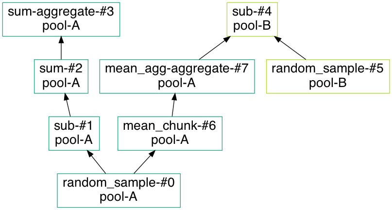

# dask-worker-pools

Assign tasks to pools of workers in dask.

```
# Launch some workers in "pool A"
$ dask-worker <scheduler_addr> --resources "pool-A=1"
$ dask-worker <scheduler_addr> --resources "pool-A=1"
$ dask-worker <scheduler_addr> --resources "pool-A=1"

# Launch some workers in "pool B"
$ dask-worker <scheduler_addr> --resources "pool-B=1"
$ dask-worker <scheduler_addr> --resources "pool-B=1"
```

```python
import dask.array as da
from dask_worker_pools import pool, propagate_pools, visualize_pools


with pool("A"):
    # Only run on pool-A workers
    a = da.random.random((10, 10))

with pool("B"):
    # Only run on pool-B workers
    b = da.random.random(10)

run_in_a = (a - 1).sum()
# ^ Want this to run only in A (transferring A data to B is expensive)

run_in_b = b - a.mean()
# ^ Want this to run in B, because `a.mean()` is smaller to transfer than all of `b`


with propagate_pools():
    # ^ Automatically propagates pool restrictions forward
    dask.compute(run_in_a, run_in_b)

visualize_pools(run_in_a, run_in_b, filename="pools.png")
```



## Installation
```
python -m pip install git+https://github.com/gjoseph92/dask-worker-pools.git@main
```
